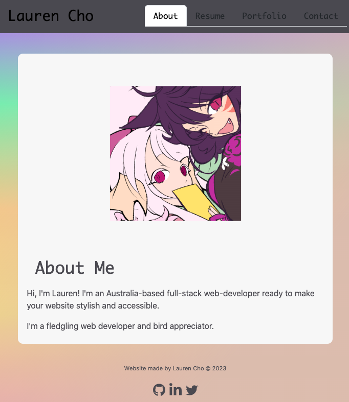

# Fullstack Portfolio

# Full Stack Web Portfolio

## Description

This project will serve to showcase my abilities as a full-stack web developer.

The repository will be updated progressively and continuously as I acquire additional skills, beyond my time as a student of the University of Adelaide coding bootcamp.

Refer to the 'Update notes' section to see my progression as a web developer.

- Link to the GitHub repository: <https://github.com/gh120515/react-portfolio>
- Link to the webpage: <https://gh120515.github.io/react-portfolio>

<!-- ## Update notes

Last updated: May 2023

- version July 2023: Added link to 'Eventify' project.

- version May 2023: Added link to 'Whiskers of Zen' project.

- version March 2023: Created the portfolio, to demonstrate and apply my current knowledge of HTML and CSS. -->

## Credits

Codes provided in the University of Adelaide Full-Stack Development bootcamp (course ID: UADEL-VIRT-FSF-PT-03-2023-U-LOLC-MTTH) was used as initial references & starting point in building the portfolio.

Icons by [FontAwesome](https://fontawesome.com/)

## License

